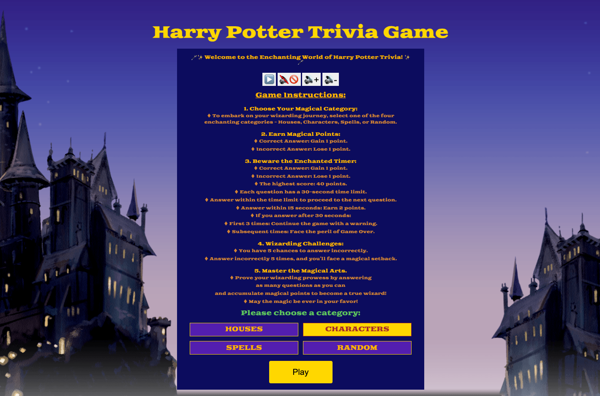

1. Live website:
https://kbmelody8.github.io/Karina-Baikanova-SEI-Project1/

2. Installation Instructions
To run the Trivia game locally, please clone the repository from GitHub:
https://github.com/kbmelody8/Karina-Baikanova-SEI-Project1.git

3. Description and Technologies Used
Harry Potter Trivia game is a web application built with HTML, CSS, and JavaScript. 
The game features a user-friendly interface with a home screen for category selection, a dynamic game screen that displays questions, immediate feedback on correct or incorrect answers with distinctive colors, and a score screen showing the total points earned. The gameplay will include a 30-second timer for each question.

4. User stories
•	As a Harry Potter fan, I want to choose from a variety of categories such as Spells, Characters, Houses, so that I can test my knowledge in specific areas of the wizarding world.
•	As a player, I want the trivia game to provide immediate feedback on whether my answer is correct or incorrect, so that I can learn and improve my Harry Potter knowledge in real-time.
•	As a competitive player, I want to see a timer for each question, so that I can challenge myself to answer quickly and add an element of excitement to the game.
•	As a casual player, I want the game to be forgiving if I don't answer within the time limit, so that I can enjoy the trivia without feeling rushed.
•	As a competitive player, I want to be rewarded with a point bonus for answering questions within the first 15 seconds, so that I can strive for higher scores and feel accomplished.
•	As a player seeking a challenge, I want the game to limit the number of incorrect answers to 5 before ending the game, so that I can strive for a high score while maintaining a level of difficulty.
•	As a player, I want to be informed about my total score and progress after each question, so that I can track my performance throughout the game.
•	As a Harry Potter fan, I want the trivia questions to cover a wide range of difficulty levels, so that I can be tested on both basic and advanced knowledge of the wizarding world.

5. Wireframes

6. Unsolved Problems/Major Hurdles

Unsolved Problems/Major Hurdles:
Fortunately, I managed to implement everything outlined in my wireframes, so there aren't any unresolved issues per se. However, looking back, I believe there's always room for improvement, and I could have enhanced certain aspects further.

Major Hurdles:
One significant challenge I faced was debugging the timer function. It seemed to intermittently skip questions or not provide enough time for players to respond, which was quite frustrating. I learned the importance of taking breaks and stepping away from the screen when encountering prolonged issues. Sometimes, a fresh perspective after a break can lead to a quicker resolution than persisting for hours on end.

Additionally, I realized that incorporating a hint function could greatly improve the user experience. Providing players with hints or clues when they're stuck on a particularly challenging question could make the game more engaging and accessible.

Another hurdle I encountered was the absence of a difficulty level assigned to questions within each category. Instead of questions appearing randomly, assigning difficulty levels could add an extra layer of challenge and strategy to the game. This is something I'd consider implementing in future iterations to enhance the overall gameplay experience.